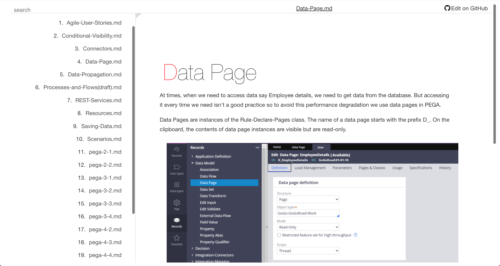

### Blogs powered by GitHub

This project was created to help people quickly create their own knowledge base from a repository of Markdown files & images hosted on GitHub.

For example, <a href="https://bloghubdemo.netlify.app/" target="_blank">a blog where I frequently offload knowledge of PEGA</a>: a low-code, Business Process Management platform.

<a href="https://bloghubdemo.netlify.app/"></a>

#### 1. Create or determine a <u>source repository.</u>

> Example: [github.com/pagodingo/notes-pega](https://github.com/pagodingo/notes-pega)

#### 2. Clone <u>this</u> project, reference your source, and select your desired title page.

```js
# environment

REACT_APP_GIT_USER_REPO={User}/{Repo}
REACT_APP_GIT_ARCHIVE_TITLEPAGE={titlePage}

Example: PagoDingo/notes-pega, 'Data-Page.md'
```

#### 3. Publish this project to any host provider of your choosing, and make changes to your content 💻 on-the-fly.

#### Changes you make (push) to your source repository will reflect on your site as soon as you refresh.

#### 
---
Host Recommendations
- <a href="https://netlify.com" target="_blank">Netlify</a>
- <a href="https://pages.github.com" target="_blank">GitHub Pages</a>
---
  **Bugs & New Features:**

Being able to **switch between multiple repositories** is next on the agenda. But before that can happen, there are a few **kinks that need to be worked out**:

**1. Embedded images are supported, external images are not.** :heavy_check_mark: [Fixed: July 27, 2022]

If you create a folder `/images` in your source repository's root, you can embed images just as you normally would:

```html

```

But, the way this works, takes not being able to support external images.

It's a really easy problem to fix. It's only a design flaw.

Due to how the HTML is produced from Markdown, it's sort of complicated to fix it in a way that makes sense. It's fixable, but to fix it the only way I know how would just be a bandaid.

**2. Folders not yet supported.** **~** :heavy_check_mark: [Fixed: September 11, 2022]

Only files present in the `/root` of your source repository get rendered, and anything that <u>isn't markdown</u> is also ignored. This doesn't feel like a hard problem to fix either, but, I know it will take a lot of careful thought to get it right, and there's no rush to do it just yet - if it was really necessary, there is a number of ways to provide the ability of grouping files.
